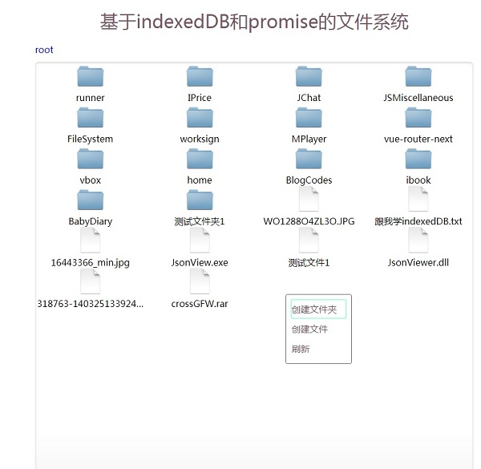
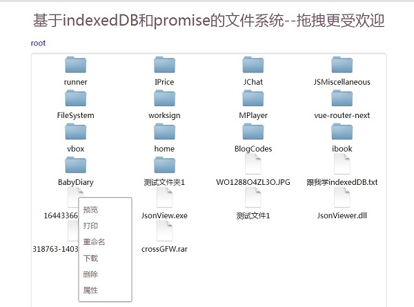
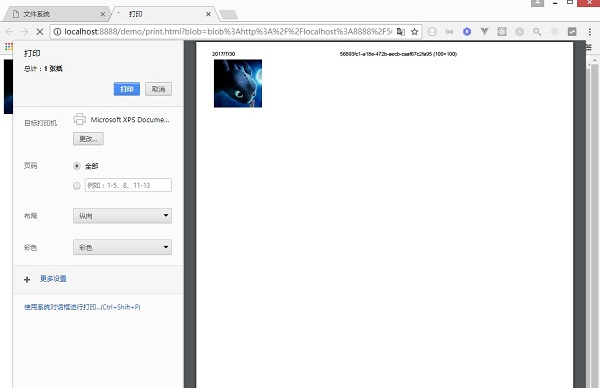

# 基于indexedDB和promise的文件系统
 

演示地址： <a href='https://xiangwenhu.github.io/FileSystem/demo/' target='blank'>https://xiangwenhu.github.io/FileSystem/demo/</a>

 
## 演示效果截图

    </img>

    </img>

    </img>

    </img>

 
## 如何使用

<code>
    window.onload = async function () {

        let fs = await FileSystem.getInstance()           
        let dir = await fs.root.getDirectory('测试文件夹1')
        let file = await fs.root.getFile('测试文件1')
        file.write('我爱北京天安门')     
        
    };
</code>

 
## 文档API
先等等，作者很忙，暂时还是看源码吧

